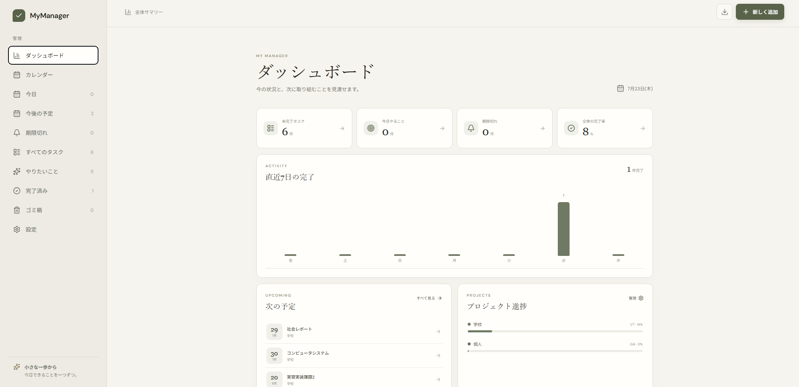
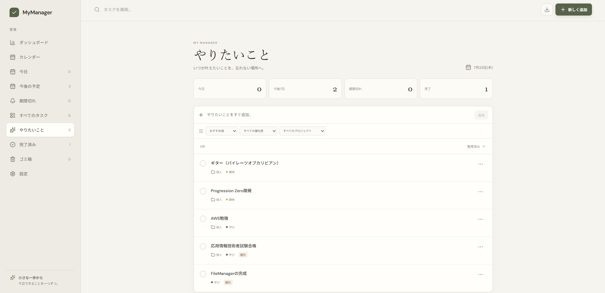
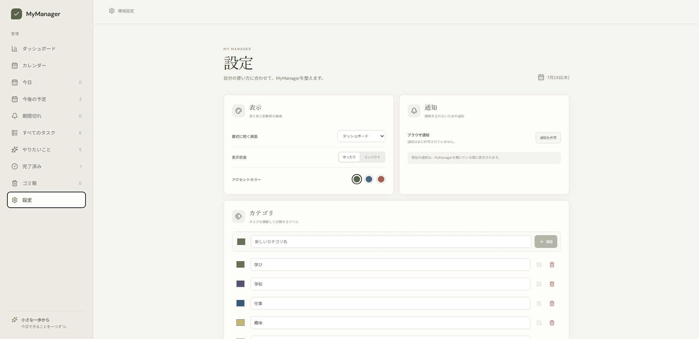
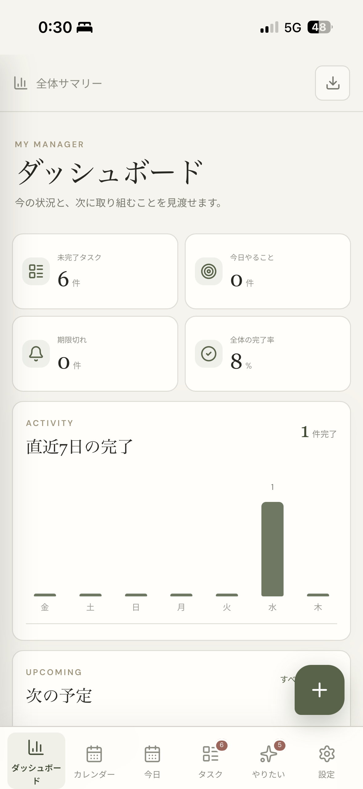
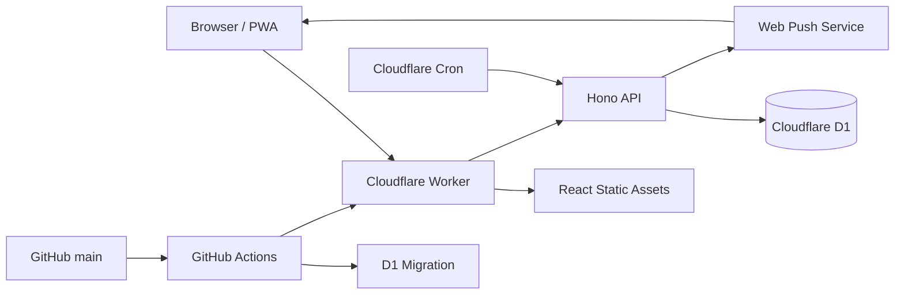

# MyManager

> 今日やることと、いつか叶えたいことを、同じ場所で無理なく管理する。

日々のタスク、期限、プロジェクト、そして「いつかやりたいこと」をまとめて整理できる、個人向けのタスク管理Webアプリです。PCだけでなく、日常的に触れるスマートフォンでの使いやすさを重視して設計・開発しました。

## スクリーンショット

### ダッシュボード



### タスク管理と設定

<p align="center">
  
  
</p>

### スマートフォン表示

<p align="center">
  
</p>

## この作品について

一般的なタスク管理ツールは高機能になるほど入力項目や画面遷移が増え、タスクを登録すること自体が負担になりがちです。MyManagerでは、思いついた瞬間に記録できる軽さと、期限・優先度・プロジェクトまで整理できる拡張性の両立を目指しました。

画面を開いたときに最初に見えるのは「今日やること」です。必要な情報だけを段階的に見せることで、管理作業ではなく、目の前の行動に集中できる体験を意識しています。

## できること

- 今日、今後7日、期限切れ、全タスクを目的別に確認
- 全体ダッシュボードで件数、完了推移、プロジェクト進捗、次の予定を確認
- 月間カレンダーから期限を確認し、日付を指定してタスクを追加
- タイトルだけですぐ登録できるクイック追加
- タスクを小さな作業へ分解し、一覧上でも完了操作できるサブタスク
- サブタスクの期限設定、一覧内追加・名称変更・削除、ドラッグ＆ドロップ
- タスクをドラッグ＆ドロップして並べ替え
- 検索・固定・色分けに対応した独立メモ
- 期限、優先度、カテゴリ、プロジェクト、メモの設定
- 毎日・毎週・毎月の繰り返しタスク
- 「いつかやりたいこと」と通常タスクの分離
- 優先度・プロジェクトによる絞り込みと並び替え
- 設定タブからカテゴリ、プロジェクト、表示テーマ、通知、データを管理
- 完了状況のサマリーと完了済み項目の一括整理
- 完了・削除操作を直後に取り消せるUndo
- 通知日時の設定とサブタスク・メモを含むJSONバックアップ・復元
- Service WorkerとWeb Pushによるバックグラウンド通知
- 1日の完了目標、連続達成日数、目標達成時の演出
- ゴミ箱からの復元、個別の完全削除、ゴミ箱を空にする操作
- PWAとしてスマートフォンのホーム画面へ追加

## UI / UXで意識したこと

### 迷わず追加できること

一覧上のクイック追加と、画面右下の追加ボタンを用意しました。詳細を決めきれていない段階でも一度記録し、あとから編集できます。

### スマートフォンで片手操作できること

主要画面は下部ナビゲーションから直接移動できます。入力画面はボトムシート形式にし、タップ領域、セーフエリア、ソフトウェアキーボード表示時のレイアウトまで調整しています。

iOSで入力欄が自動拡大されないよう文字サイズを16px以上に保ちつつ、利用者自身のピンチズームは制限しない設計です。

### 情報量を段階的に増やすこと

一覧ではタイトルを主役にし、プロジェクト、期限、繰り返し、通知などの補助情報は小さなメタ情報としてまとめています。詳細設定は追加・編集画面に集約しました。

## 技術的な特徴

- フロントエンドとAPIを一つのCloudflare Workerから配信
- Cloudflare D1によるSQLite互換のデータ永続化
- D1マイグレーションによるスキーマ変更の管理
- タスク完了時に次回分を生成する繰り返し処理
- Cron TriggerとVAPID認証を利用したWeb Push通知
- 操作直後に画面へ反映し、失敗時に戻すOptimistic UI
- APIをキャッシュ対象外にしたService Worker設計
- GitHubの`main`へのPushを起点とした自動マイグレーション・デプロイ
- TypeScriptの共有型によるフロントエンドとAPI間の整合性確保

## アーキテクチャ



Cloudflare内で静的配信、API、データベースを完結させることで、個人開発でも運用箇所を増やさず、低い管理コストで公開できる構成にしています。

## 使用技術

| 分類 | 技術 | 用途 |
| --- | --- | --- |
| Frontend | React / TypeScript | UIと状態管理 |
| Styling | CSS | レスポンシブUI、モバイル最適化 |
| Build | Vite | 開発環境と本番ビルド |
| API | Hono / Cloudflare Workers | CRUD APIと静的配信 |
| Database | Cloudflare D1 | タスク、カテゴリ、プロジェクトの保存 |
| PWA | Web App Manifest / Service Worker | ホーム画面追加とアプリシェルのキャッシュ |
| CI/CD | GitHub Actions / Wrangler | 型チェック、DB更新、自動デプロイ |

## 実装で工夫した点

### 繰り返しタスク

繰り返しタスクを完了した時点で、現在の項目は完了履歴として残しながら、設定された周期に応じて次回分を自動生成します。履歴と次の予定を両立できる構造にしています。

### D1マイグレーション

ローカルSQLiteと本番D1の差異を考慮し、カラム追加時に非定数のデフォルト式へ依存しないマイグレーションにしています。GitHub Actionsではアプリのデプロイ前にマイグレーションを適用します。

### Service Worker

画面を構成する静的ファイルだけをキャッシュし、タスクAPIは常にネットワークへ接続します。レスポンス本文を安全に複製してからキャッシュすることで、ストリームの二重消費も防いでいます。

## 現在のスコープ

本作品は一人で使うパーソナルツールとして設計しています。データは複数端末から同じD1へ同期されますが、アプリ内に複数ユーザー向けのアカウント機能はありません。個人データを保存して運用する場合は、Cloudflare Accessで利用者を制限する想定です。

今後の拡張候補として、Web Pushによるバックグラウンド通知、ユーザーごとのデータ分離を想定しています。

## ローカルで動かす

Node.js 22以上を使用します。

```bash
npm install
npm run db:migrate:local
npm run dev
```

ローカルのD1データは`.wrangler/`以下に保存されます。

## 主なコマンド

| コマンド | 内容 |
| --- | --- |
| `npm run dev` | ローカル開発サーバーを起動 |
| `npm run check` | TypeScriptの型チェック |
| `npm run build` | 本番用にビルド |
| `npm run db:migrate:local` | ローカルD1へマイグレーションを適用 |
| `npm run db:migrate:remote` | 本番D1へマイグレーションを適用 |
| `npm run push:keys` | Web Push用VAPID鍵を生成 |
| `npm run deploy` | Cloudflareへデプロイ |

## CI/CD

GitHub Actionsは`main`ブランチへのPushを検知し、次の順序で本番環境を更新します。

1. 依存関係の再現
2. TypeScriptの型チェック
3. D1マイグレーション
4. Cloudflare Workersへのデプロイ

リポジトリのActions Secretには、Workers ScriptsとD1の編集権限を持つ`CLOUDFLARE_API_TOKEN`を設定します。

### バックグラウンド通知の初期設定

Web Pushでは、送信元を証明するVAPID鍵を一度だけ設定します。

```bash
npm run push:keys
```

表示されたJSONをGitHub Actions Secretの`VAPID_PRIVATE_JWK`へ保存します。`VAPID_SUBJECT`には、連絡先として`mailto:your-address@example.com`または管理しているHTTPS URLを設定します。次回のPush時にActionsがCloudflare Worker Secretへ安全に登録します。

デプロイ後、「設定 → 通知 → バックグラウンド通知」から端末ごとに有効化できます。iPhone/iPadでは、ホーム画面へ追加したPWAから設定してください。
